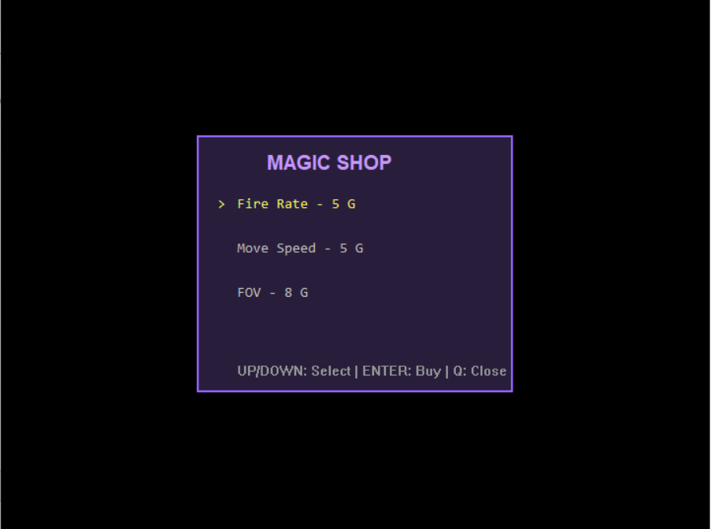
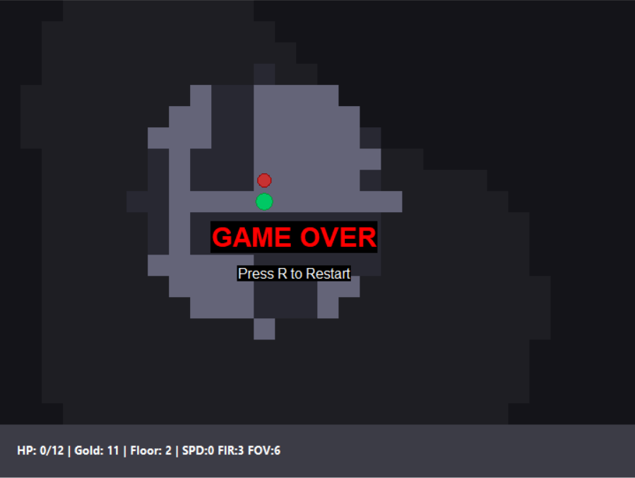

# 2D Roguelite (Win32 API)

## Описание игры
Данный проект представляет собой 2D-игру в жанре "рогалик" (Roguelite), написанную на чистом стандарте языка C с использованием исключительно Win32 API и GDI для отрисовки. 

**Ключевые механики:**
* Процедурная генерация комнат и коридоров подземелья (каждый этаж уникален).
* Система "Тумана войны" (Fog of War) — игрок видит только исследованную область.
* Боевая система: стрельба снарядами, ближний бой врагов, наличие этажей с боссами (каждый 10-й уровень).
* Экономика и прокачка: сбор золота и покупка улучшений в магазине (скорость стрельбы, скорость перемещения, радиус обзора).
* Стабильный игровой цикл с фиксированным шагом (Fixed Time Step) без использования `Sleep`.

## Управление
Взаимодействие с игрой осуществляется через клавиатуру:
* **W, A, S, D** или **Стрелки** — Перемещение персонажа и навигация по меню магазина.
* **Space (Пробел)** — Выстрел в направлении последнего движения.
* **Enter / Space** — Подтверждение покупки в магазине.
* **Q** — Закрыть окно магазина.
* **R / Enter** — Перезапуск игры после поражения (Game Over).

## Инструкция по сборке
Проект не имеет сторонних зависимостей и может быть собран из командной строки с использованием стандартных компиляторов (GCC/MinGW или MSVC).

**Вариант 1: Использование GCC (MinGW)**
Выполните следующую команду в директории с исходным кодом:
`gcc main.c core.c ui.c -o game.exe -lgdi32 -mwindows -std=c11`

**Вариант 2: Использование MSVC (Developer Command Prompt для Visual Studio)**
`cl /W4 /Fe:game.exe main.c core.c ui.c user32.lib gdi32.lib`

## Архитектура и реализованные модули
Код строго разделен на независимые модули для сепарации логики и представления. Взаимодействие между модулями происходит через передачу указателя на единую структуру состояния `GameState`.

* **`common.h`** — общие константы, перечисления (типы тайлов, состояние тумана) и глобальная структура состояния игры `GameState`.
* **`core.c` / `core.h` (Logic / Core)** — отвечает за игровую логику. Включает: процедурную генерацию уровней, математику перемещения, проверку коллизий, ИИ противников (поиск пути по радиусу видимости) и управление таймерами. В этот модуль не передаются дескрипторы `HWND` или `HDC`.
* **`ui.c` / `ui.h` (Interface / UI)** — отвечает за создание главного окна игры, обработку цикла сообщений Win32, ввод с клавиатуры и отрисовку. Для предотвращения мерцания реализована двойная буферизация (`CreateCompatibleDC`, `BitBlt`).

## Ресурсы и графика
Сторонние `.bmp` спрайты в данном проекте не используются. 
Вся визуализация построена исключительно на базовых примитивах GDI Win32 API (`Rectangle`, `Ellipse`, `FillRect`, `TextOutA`) с ручным управлением кистями (`HBRUSH`) и перьями (`HPEN`), которые корректно освобождаются через `DeleteObject` для предотвращения утечек памяти.

## Скриншоты работы

